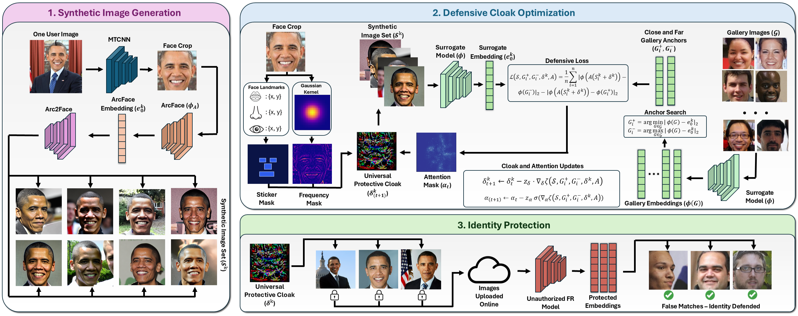

# FaceCloak - Personalized Face Privacy Protection From a Single Image

### Abstract
Photos of faces uploaded online are vulnerable to malicious actors who can scrape facial images from online sources and intrude on personal privacy via unauthorized use of deep neural network (DNN) facial recognition models. This paper presents FaceCloak, a novel personalized face privacy protection system, which can generate defensive identity-specific universal face privacy masks from a single image of a user, causing facial recognition to fail. FaceCloak introduces a three-stage personalized face perturbation learning methodology: (1) It generates a small set of high-variety synthetic face images of a person based on a single image of the person. (2) It develops novel methods to learn face cloaking by adding more protection to key facial-identity leakage regions through iterative perturbation generation over the small set of synthetic images, effectively shifting a user's identity embedding towards a distant anchor identity and away from a similar one. (3) It generates a personalized identity-protective mask in the form of pixel-wise cloaking, which is light-weight and can be efficiently applied to any facial image of a user while maintaining good human-perceived quality. Extensive experiments on three popular face datasets across ten recognition models show the effectiveness of FaceCloak compared to 29 other existing representative methods.

### System Overview


# Usage Instructions
### Environment Setup
We use Python version 3.10.16 for all of our experiments. 
1. Clone our repository.
2. Create a virtual environment using Conda or venv.
3. Install all dependencies from `requirements.txt`.
4. Download datasets and models from links below.

### Datasets and Models
Our splits of probe and gallery datasets are available at the links below:

<b>Datasets:</b> <a href='https://drive.google.com/drive/folders/1bvSvoxfuWdn5UVhhwlV7_9_oTHa5z6Is?usp=sharing'>[Google Drive Link]</a><br>
Put the `data` folder at the top level directory.

<b>Models:</b> <a href='https://drive.google.com/drive/folders/1jgkQ3VSSYamig9Ro5tM4g8Cig4VEnjRk?usp=sharing'>[Google Drive Link]</a><br>
Put the `model_checkpoints` folder at the top level directory.

### Running the Code
We provide a handler script in that allows for batch submission of Slurm jobs to run experiments with different parameters. This file contains a description of each config variable. Once run, it creates a script for submitting a Slurm job for each combination of hyperparameters enumerated in the file. You can run this script with:
```
python src/run_cloak_experiments.py
```

If you wish to run a single job you may configure a single set of hyperparameters in this file, or run a custom job via command line arguments with:
```
python src/cloak.py
```
The outputs of both of these runs will be stored in `outputs/{run_name}` where `run_name` is determined by the job running file based on the chosen hyperparameters. Cloaked images and synthetic images will be stored in `data/cloaked/{run_name}`.

# Acknowledgements
Thank you to the following repositories for providing open source code that assisted with the development of this project:
<ul>
  <li><a href='https://github.com/Shawn-Shan/fawkes'>Fawkes</a></li>
  <li><a href='https://github.com/liuxuannan/AdvCloak'>AdvCloak</a></li>
  <li><a href='https://github.com/CGCL-codes/AMT-GAN'>AMT-GAN</a></li>
  <li><a href='https://github.com/foivospar/Arc2Face'>Arc2Face</a></li>
  <li><a href='https://github.com/deepinsight/insightface'>InsightFace</a></li>
</ul>

